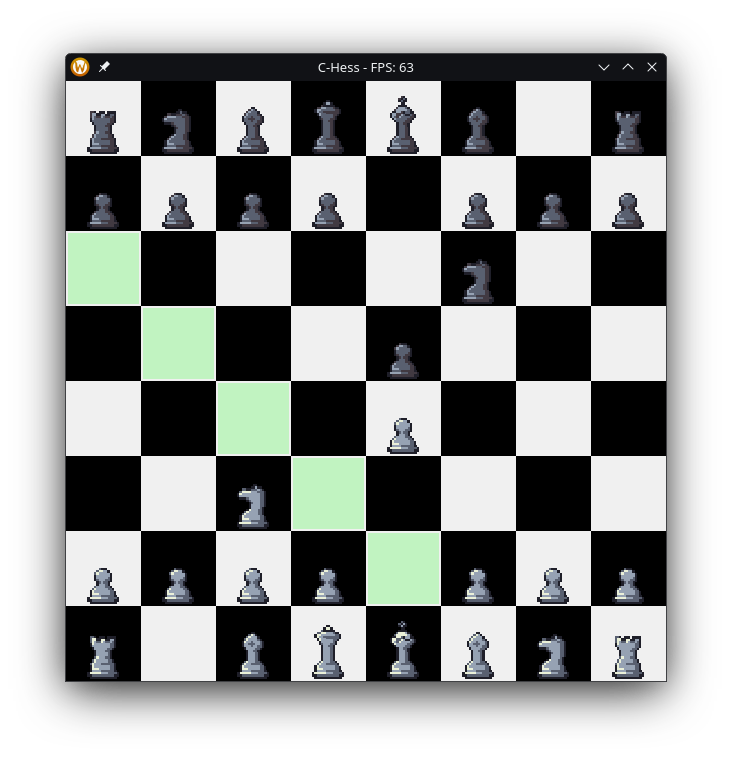

# C-Hess
A simple chess game built in C using SDL2. This is still very much a work in progress.




## Requirements
- SDL2
- SDL2_image
- SDL2_ttf
- GCC or any C compiler
- Make

## Compiling and Running

There is a Makefile included for easy compilation. Simply run:
```bash
make
```

The output binary will be named `chess`. To run the game, execute:
```bash
./chess
```

Alternatively, you can compile and run using the following command: 
```bash
./run.sh
```

## Controls
- Mouse:
  - Left Click: Select and move pieces

- Keyboard:
  - ESC Quit the game
  - SPACE: Pause/Unpause the game
  - H: Show full move history
  - L: Show last 10 moves
  - U: Undo last move
  - ?: Show help menu

## TODO
- [x] Switch from CPU to to GPU with SDL_Renderer and SDL_Texture
- Implement full chess rules (check, checkmate, stalemate, castling, en passant, promotion)
    - [x] Basic movement rules for each piece (besides en passant and castling)
    - [x] Transfer turns between players
    - [x] En passant
    - [ ] Detecting checkmate and stalemate ~20%
    - [ ] Castling ~75%
    - [ ] Pawn promotion ~50%
- [ ] Implement AI opponent -> Minimax algorithm with alpha-beta pruning, maybe even neural networks down the line
- [ ] Implement online multiplayer mode (if i get to it and don't get bored of this project)

